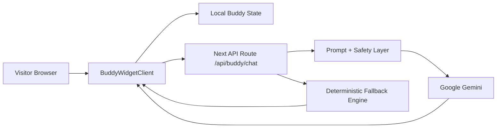

# PetBlack Buddy

PetBlack is a Next.js app with an interactive on-site Buddy companion.

## Buddy Idea (Hybrid Local + Gemini)

Each visitor gets a deterministic Buddy identity (stable across refreshes), while chat responses are generated by Gemini when available and fall back to local scripted behavior when not.

### Core behavior

- Deterministic visitor identity seed (from localStorage/cookie)
- Stable buddy profile (species, rarity, personality traits)
- Floating Buddy widget with open/minimized states
- Server-side Gemini integration for structured responses
- Resilient fallback response engine for outages and missing keys

## Architecture Overview

## Project Structure (Buddy)

- `src/features/buddy/domain/*` — deterministic buddy generation, contracts, and session primitives.
- `src/features/buddy/ui/*` — floating widget, sprite/avatar rendering, chat panel.
- `src/features/buddy/server/*` — Gemini client, prompt builder, response normalization, fallback strategy.
- `src/app/api/buddy/chat/route.ts` — API route with validation and safety guardrails.
- `src/app/page.tsx` — homepage mount point for the Buddy widget.

## Run Locally

1. Install dependencies:
   - `pnpm install`
2. Create your environment file:
   - copy `.env.local.example` to `.env.local`
3. Configure Gemini:
   - set `GEMINI_API_KEY` in `.env.local`
4. Start development server:
   - `pnpm dev`
5. Open the site and launch the Buddy widget.

## Environment Variables

- `GEMINI_API_KEY` — required for live Gemini replies.
- `GEMINI_MODEL` — optional (defaults to `gemini-2.0-flash-lite-001` if omitted).

If `GEMINI_API_KEY` is missing, Buddy remains functional using deterministic fallback responses.

## Safety and Reliability

- Input length limits and basic sanitization
- Server-side prompt guardrails (short, safe, on-topic responses)
- Structured output contract (`reply`, `emotion`, optional `action`)
- Runtime fallback path if Gemini times out or errors

## Verification Checklist

- Buddy widget appears and opens/closes correctly on homepage
- Same browser gets the same deterministic Buddy identity
- Gemini mode responds when key is configured
- Fallback mode responds when key is absent or provider fails
- Lint and type checks pass for touched files

## Delivery Roadmap

- **Phase 1**: deterministic buddy + local fallback responses
- **Phase 2**: Gemini integration behind env-enabled behavior
- **Phase 3**: richer animations, memory, and contextual interactions

## Naming Notes (Brand Direction)

PetBlack carries a “dark + luminous” theme. Suggested naming inspirations:

- Dual meaning names: `Kiara/Ciara`, `Blake`, `Sorcha`
- “Light in darkness” names: `Nishdeep`, `Ayla`, `Cahaya`, `Lucero`
- Natural/metaphorical: `Onyx`, `Obsidian`, `Jet`, `Cole`
- Char-variants: `Chara`, `Charlume`, `Chardana`, `Charon`

-----------------------

Charcoal/Carbon

- Char: is a punchy, modern choice that carries a lot of "glowing ember" energy. It works well because it sounds like a nickname but feels complete on its own.

## Names with Dual Meanings (Dark & Light)

- Kiara / Ciara: These names are often linked to the Italian Chiara (meaning "bright" or "clear") and the Irish Ciara (meaning "little dark one").
- Blake: From Old English, it can mean "dark" or "black", but historically it also meant "fair" or "shining".
- Sorcha: While it is sometimes associated with "dark" in certain contexts, its most common Gaelic meaning is "bright" or "radiant", creating a name that feels both mysterious and luminous. 

## Names Meaning "Light in the Darkness"

- Nishdeep: A Sanskrit name literally meaning "a lamp in the darkness" (nisha for night, dipa for lamp).
- Ayla: A Turkish name meaning "moonlight" or "halo," representing a bright light surrounded by the dark sky.
- Cahaya (or Cahya): An Indonesian name that translates to "one who is the light in the darkness".
- Lucero: A Spanish name meaning "bright star" or "morning star," depicting a point of intense light against the blackness of space. 

## Natural & Metaphorical Names

- Onyx: A sleek black gemstone known for its lustrous, "bright" finish.
- Obsidian: A volcanic glass that is naturally pitch black but highly reflective and glassy.
- Jett / Jet: Inspired by the gemstone jet, which is dense black and polishes to a high shine.
- Cole: While it primarily means "swarthy" or "coal black," it carries the same "bright when burning" energy as your original idea of Charcoal. 

## A few ways to lean into that "black and bright" vibe

- Chara: A Greek name meaning "joy" or "happiness." It keeps the "Char" sound but adds a literal "bright" meaning.
- Charlume: A creative blend of Char (dark/burnt) and Lume (light/illumination).
- Chardana: A name that feels grounded like charcoal but has a rhythmic, bright ending.
- Charon: While often associated with the ferryman of the underworld (dark), it is also the name of a moon, making it a "bright" object in the dark sky. 

