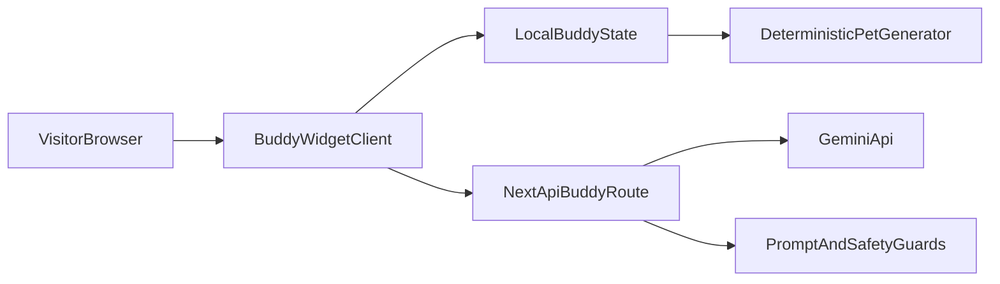

# Hybrid Buddy + Gemini Integration Plan

## Goal

Add an interactive on-site Buddy companion for visitors in `apps/petblack-com` that:

- deterministically assigns a pet identity per visitor,
- supports lightweight chat in a widget,
- uses Gemini for richer responses when available,
- gracefully falls back to local scripted behavior.

## Target Architecture

## Implementation Scope

- Reuse conceptual Buddy ideas from `apps/petblack-com/AGENTS.md`, but implement web-native React/Next.js components (not CLI/Ink internals).
- Keep the current homepage visual intact while layering Buddy as a floating assistant.
- Use env-driven Gemini configuration so no secrets are shipped to the client.

## Files to Add/Update

- Update page composition in `apps/petblack-com/src/app/page.tsx`.
- Add Buddy UI component(s) under `apps/petblack-com/src/components/buddy/` (widget shell, avatar/sprite, chat panel).
- Add deterministic pet model utilities under `apps/petblack-com/src/lib/buddy/` (seed/hash/species/personality fallback).
- Add server route for AI replies at `apps/petblack-com/src/app/api/buddy/route.ts`.
- Add optional client storage helper for visitor/session ID and chat history in `apps/petblack-com/src/lib/buddy/storage.ts`.
- Add environment setup documentation in `apps/petblack-com/README.md`.

## Behavior Design

- **Deterministic identity**
  - Generate a stable `visitorId` (localStorage/cookie).
  - Hash it to species/rarity/traits so each visitor gets a recurring buddy.
- **Hybrid response strategy**
  - If Gemini key is configured: send constrained prompt with buddy persona + visitor message.
  - If unavailable or error: fall back to local templated responses by intent tags (greeting, pet-care question, product curiosity, playful banter).
- **UX**
  - Floating Buddy button + expandable chat panel.
  - Starter message introducing buddy name/species.
  - Typing indicator and rate-limited sends.

## Safety

- Basic input length limits and sanitization.
- Guardrails in the system prompt: keep responses pet-friendly, short, and on-topic.

## Verification Plan

- Manual browser checks in development:
  - Buddy appears on homepage and opens/closes correctly.
  - Same visitor keeps the same buddy identity across refresh.
  - Gemini mode replies when key exists.
  - Fallback mode replies when key is absent.
- Run lint/type checks for touched files.

## Delivery Notes

- MVP first: text-based buddy with lightweight avatar/sprite.
- Phase 2 (optional): richer animations, memory profile, and contextual tips based on page section.

## To-dos

- [ ] Define Buddy data contracts (visitor identity, pet profile, chat message shape, fallback intents).
- [ ] Implement floating Buddy widget UI and local deterministic identity generation.
- [ ] Create Next.js API route that calls Gemini and returns normalized replies with safety guardrails.
- [ ] Add resilient fallback response engine and runtime selection between AI and local responses.
- [ ] Document env setup and run lint/type/manual verification checklist.

