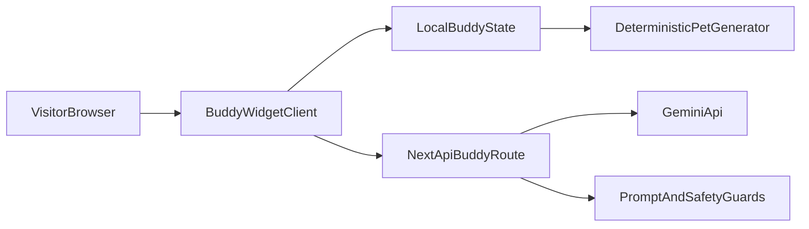

# Hybrid Buddy + Gemini Integration Plan

## Goal
Add an interactive on-site Buddy companion for visitors in `apps/petblack-com` that:
- deterministically assigns a pet identity per visitor,
- can chat in a lightweight widget,
- uses Gemini for richer responses when available,
- gracefully falls back to local scripted behavior.

## Target Architecture

## Implementation Scope
- Reuse the conceptual Buddy ideas from [apps/petblack-com/AGENTS.md](apps/petblack-com/AGENTS.md) but implement web-native React/Next.js components (not CLI/Ink internals).
- Keep current homepage visual intact while layering Buddy as a floating assistant.
- Use env-driven Gemini key so no secrets are shipped to client.

## Files To Add/Update
- Update page composition in [apps/petblack-com/src/app/page.tsx](apps/petblack-com/src/app/page.tsx).
- Add Buddy UI component(s) under `apps/petblack-com/src/components/buddy/` (widget shell, avatar/sprite, chat panel).
- Add deterministic pet model utilities under `apps/petblack-com/src/lib/buddy/` (seed/hash/species/personality fallback).
- Add server route for AI replies at `apps/petblack-com/src/app/api/buddy/route.ts`.
- Add optional client storage helper for visitor/session ID and chat history in `apps/petblack-com/src/lib/buddy/storage.ts`.
- Add env documentation in [apps/petblack-com/README.md](apps/petblack-com/README.md).

## Behavior Design
- Deterministic identity:
  - Generate stable `visitorId` (localStorage/cookie).
  - Hash to species/rarity/traits so each visitor gets their own recurring buddy.
- Hybrid response strategy:
  - If Gemini key configured: send constrained prompt with buddy persona + visitor message.
  - If unavailable or error: fallback to local templated responses based on intent tags (greeting, pet-care question, product curiosity, playful banter).
- UX:
  - Floating Buddy button + expandable chat panel.
  - Starter message introducing buddy name/species.
  - Typing indicator and rate-limited sends.
- Safety:
  - Basic input length limits and sanitization.
  - Guardrails in system prompt: keep pet-friendly, short, and on-topic.

## Verification Plan
- Manual browser checks in dev:
  - Buddy appears on homepage and opens/closes correctly.
  - Same visitor keeps same buddy identity across refresh.
  - Gemini mode replies when key exists.
  - Fallback mode replies when key is absent.
- Run lint/type checks for touched files.

## Delivery Notes
- MVP first: text-based buddy with lightweight avatar/sprite.
- Phase 2 (optional): richer animations, memory profile, and contextual tips based on page section.