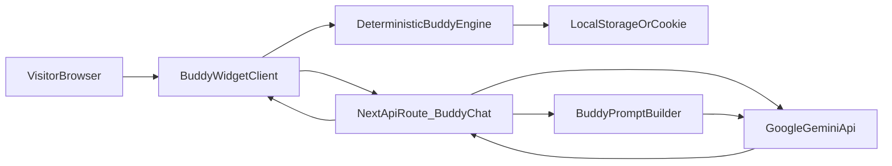

# Hybrid Buddy + Gemini Integration Plan

## Goal
Add an interactive “Buddy” pet to your Next.js site where each visitor gets a deterministic companion, and conversations/reactions are generated by Google Gemini.

## Current Baseline (What we will leverage)
- Existing web app entrypoint and UI shell are in [`c:/workspace/apps/petblack-com/src/app/page.tsx`](c:/workspace/apps/petblack-com/src/app/page.tsx) and [`c:/workspace/apps/petblack-com/src/app/page.module.css`](c:/workspace/apps/petblack-com/src/app/page.module.css).
- Existing buddy domain assets exist in [`c:/workspace/apps/petblack-com/src/buddy/types.ts`](c:/workspace/apps/petblack-com/src/buddy/types.ts), [`c:/workspace/apps/petblack-com/src/buddy/companion.ts`](c:/workspace/apps/petblack-com/src/buddy/companion.ts), and [`c:/workspace/apps/petblack-com/src/buddy/sprites.ts`](c:/workspace/apps/petblack-com/src/buddy/sprites.ts).
- Some buddy files are CLI-only (Ink/Bun/runtime-specific), especially [`c:/workspace/apps/petblack-com/src/buddy/CompanionSprite.tsx`](c:/workspace/apps/petblack-com/src/buddy/CompanionSprite.tsx) and [`c:/workspace/apps/petblack-com/src/buddy/useBuddyNotification.tsx`](c:/workspace/apps/petblack-com/src/buddy/useBuddyNotification.tsx), so these will be treated as reference patterns, not directly imported into web UI.

## Architecture (Hybrid)

## Implementation Plan
- Create a web-safe buddy domain layer under `src/features/buddy/` that reuses deterministic species/rarity/stat ideas from the existing buddy code, but removes Bun/Ink dependencies.
- Build a Buddy session model (visitorId, bones, soul, mood, timestamps, interactionCount) with deterministic generation from a stable anonymous visitor ID (cookie/localStorage).
- Add a Gemini server endpoint in `app/api/buddy/chat/route.ts` that receives user message + buddy context and returns constrained Buddy replies/reactions.
- Add a client Buddy widget (floating panel + minimized state + sprite + chat bubble) and mount it on the homepage in `src/app/page.tsx`.
- Add safety controls: prompt template constraints, max token/length caps, basic input sanitization, and rate limiting guardrails at API route level.
- Add configuration via environment variables for Gemini key/model and fail-safe behavior when key is missing.
- Add lightweight telemetry hooks (optional local logs first) for interaction volume and error visibility.
- Add test coverage for deterministic roll logic and API response shaping.

## File-Level Change Targets
- Update [`c:/workspace/apps/petblack-com/src/app/page.tsx`](c:/workspace/apps/petblack-com/src/app/page.tsx) to render Buddy widget alongside existing hero image.
- Update [`c:/workspace/apps/petblack-com/src/app/page.module.css`](c:/workspace/apps/petblack-com/src/app/page.module.css) with Buddy positioning and responsive behavior.
- Add `src/features/buddy/domain/*` (types, deterministic generator, serialization helpers).
- Add `src/features/buddy/ui/*` (widget, sprite renderer for web, chat panel).
- Add `src/app/api/buddy/chat/route.ts` (Gemini integration route).
- Add `src/features/buddy/server/geminiClient.ts` and `promptBuilder.ts` (provider abstraction + prompt shaping).
- Update docs in [`c:/workspace/apps/petblack-com/README.md`](c:/workspace/apps/petblack-com/README.md) with env vars and run instructions.

## Gemini Integration Details
- Use Google Gemini as the generation backend with server-side key usage only.
- Prompt style:
  - System: define Buddy persona boundaries and tone.
  - Context: include deterministic buddy profile (species, rarity, stats, personality).
  - User: current visitor message.
  - Output contract: short structured JSON (`reply`, `emotion`, optional `action`) to keep UI predictable.
- Add fallback deterministic canned responses when Gemini fails/timeouts so Buddy always responds.

## Acceptance Criteria
- Visitor sees a Buddy widget on page load.
- Buddy identity remains stable across refreshes for the same browser/session seed.
- User can send messages and receive Gemini-powered Buddy replies.
- App handles Gemini outages gracefully with fallback responses.
- No Bun/Ink/terminal-only imports are used in browser bundles.
- README includes setup steps for required Gemini environment variables.

## Risks and Mitigations
- Source compatibility risk (CLI buddy code in web): isolate and port only pure logic, avoid direct UI/runtime reuse.
- Token cost/latency risk: enforce short replies + token caps + optional cooldown.
- Prompt drift risk: strict output schema and server-side parser/validation.

## Rollout Strategy
- Phase 1: deterministic buddy + local canned responses.
- Phase 2: Gemini responses behind env-enabled flag.
- Phase 3: richer animation/mood memory once baseline is stable.