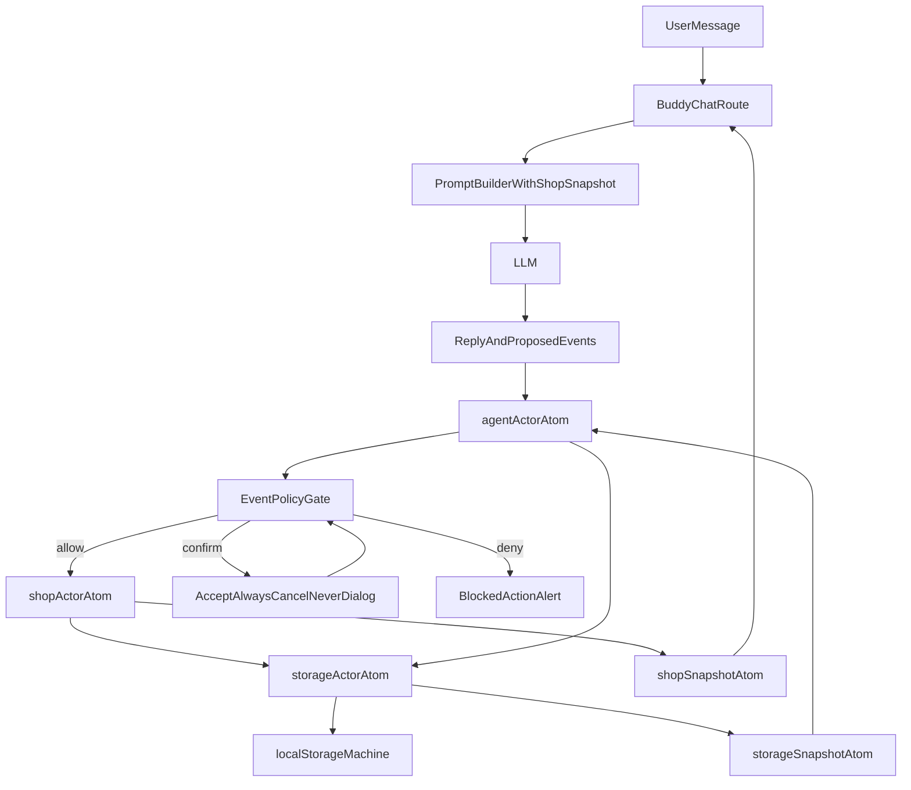

# Petblack Agent + Shop Machine Plan

## Outcome
Build an event-driven architecture where:
- `storage-machine` defines the swappable persistence/event contract.
- `local-storage-machine` is the current concrete implementation.
- `shop-machine` owns app commerce/workflow state and user-driven interactions.
- `agent-machine` owns Buddy orchestration loops and can interact with `shop-machine` by proposing/sending events.
- Buddy responses include both user-facing text and a sequence of machine events.
- Event execution is gated by policy: immediate allow, hard block, or confirmation.

## Scope (all machines together)
- Implement `storage-machine`, `shop-machine`, and `agent-machine` in parallel with explicit contracts.
- Keep storage local (`localStorage`) now via `machines/local-storage`, but route usage through `machines/storage` contracts so backend persistence can be introduced later without rewriting `shop`/`agent` logic.
- Wire Buddy chat request/response pipeline to machine snapshots and event plans.

## File structure and naming conventions

### Machine folders
- `apps/petblack-com/src/machines/storage/`
  - `storage-event-types.ts`
  - `storage-events.ts`
  - `storage-context.ts`
  - `storage-actions.ts`
  - `storage-actors.ts`
  - `storage-setup.ts`
  - `storage-machine.ts`
  - `storage-states.ts`
- `apps/petblack-com/src/machines/local-storage/`
  - `local-storage-event-types.ts` (or reuse storage types where possible)
  - `local-storage-events.ts` (or reuse storage events)
  - `local-storage-context.ts`
  - `local-storage-actions.ts`
  - `local-storage-actors.ts`
  - `local-storage-setup.ts`
  - `local-storage-machine.ts`
  - `local-storage-states.ts`
- `apps/petblack-com/src/machines/shop/`
  - `shop-machine.ts`
  - `shop-context.ts`
  - `shop-actions.ts`
  - `shop-actors.ts`
  - `shop-events.ts`
  - `shop-event-types.ts`
  - `shop-setup.ts`
  - `shop-states.ts`
- `apps/petblack-com/src/machines/agent/`
  - `agent-machine.ts`
  - `agent-context.ts`
  - `agent-actions.ts`
  - `agent-actors.ts`
  - `agent-events.ts`
  - `agent-event-types.ts`
  - `agent-setup.ts`
  - `agent-states.ts`

### Atoms at app root (`src/atoms`)
Per your convention, machine atoms/selectors live at root and are default-exported one-per-file.

- `apps/petblack-com/src/atoms/shop-actor-atom.ts`
- `apps/petblack-com/src/atoms/shop-snapshot-atom.ts`
- `apps/petblack-com/src/atoms/shop-machine-atom.ts`
- `apps/petblack-com/src/atoms/shop-snapshot-<selector>-atom.ts` (one selector per file)
- `apps/petblack-com/src/atoms/agent-actor-atom.ts`
- `apps/petblack-com/src/atoms/agent-snapshot-atom.ts`
- `apps/petblack-com/src/atoms/agent-machine-atom.ts`
- `apps/petblack-com/src/atoms/agent-snapshot-<selector>-atom.ts` (one selector per file)
- `apps/petblack-com/src/atoms/storage-actor-atom.ts`
- `apps/petblack-com/src/atoms/storage-snapshot-atom.ts`
- `apps/petblack-com/src/atoms/storage-machine-atom.ts`
- `apps/petblack-com/src/atoms/storage-snapshot-<selector>-atom.ts` (one selector per file)

### Policy + persistence
- `apps/petblack-com/src/machines/policy/`
  - `event-policy-types.ts`
  - `event-policy-events.ts` (if modeled as machine messages)
  - `event-policy-repository.ts` (shared contract)
- `apps/petblack-com/src/machines/storage/` holds common storage machine contracts used by both shop and agent domains.
- `apps/petblack-com/src/machines/local-storage/` provides the active concrete implementation using `localStorage`.

## Architecture and responsibilities

### `storage-machine` + `local-storage-machine`
- `storage-machine` is the common event/state contract for persistence and retrieval (swappable architecture boundary).
- `local-storage-machine` is installed behind that contract for now and handles concrete browser storage effects.
- `shop-machine` and `agent-machine` interact with storage through storage-machine events, not direct `localStorage` calls.
- Later backend migration swaps machine wiring implementation while preserving shared event contracts.

### `shop-machine`
- Source of truth for shopping state (lists, cart flow status, pickup/autoship state, search state references needed by agent collaboration).
- Accepts user UI events and vetted agent events.
- Persists/loads via storage-machine event interactions.
- Emits result-oriented state that Buddy can consume via `shopSnapshotAtom`.

### `agent-machine`
- Owns the multi-stage orchestration loop:
  - interpret user intent
  - request shop operations (e.g., search)
  - receive resulting state/data
  - call model again with updated snapshot
  - select action and propose/dispatch events
- Owns staged event proposals (pending/awaiting approval/executed/rejected).
- Does not directly mutate shop data; it communicates by eventing through `shopActorAtom`.
- Uses storage-machine loops for persistence and for multi-stage “request -> result -> next request” orchestration state.

### Buddy API integration
Existing pipeline entry points:
- `apps/petblack-com/src/app/api/buddy/chat/route.ts`
- `apps/petblack-com/src/widgets/buddy/server/promptBuilder.ts`
- `apps/petblack-com/src/widgets/buddy/server/geminiClient.ts`
- `apps/petblack-com/src/widgets/buddy/server/responseSchema.ts`
- `apps/petblack-com/src/widgets/buddy/domain/types.ts`

Planned changes:
- Include in each model call:
  - current shop machine state value
  - current shop context snapshot (sanitized)
  - machine states JSON / documentation payload for actionable transitions
- Extend model output schema to include:
  - `reply` text
  - `events` array (typed event envelopes)
- Route/client converts those events into `agent-machine` input events (not direct blind dispatch).

## Event policy model (Accept/Always/Cancel/Never)
- **Always**: Add event type (optionally scoped) to allowlist; execute immediately now and in future.
- **Never**: Add to denylist; never execute; show alert that action was blocked by policy.
- **Accept**: Execute once for this proposal only; no policy persistence.
- **Cancel**: Reject once; no policy persistence.

Policy resolution order:
1. If event matches denylist: block + alert.
2. Else if event matches allowlist: execute.
3. Else require confirmation dialog.

Persistence:
- Policy lists stored in localStorage now through repository interface.
- Machine setup accepts injected repository so backend persistence can replace local storage later.

## Suggested event contract
- Introduce envelope type used between Buddy and agent machine:
  - `id`, `source`, `targetMachine`, `eventType`, `payload`, `reason`, `safetyLevel`
- Shop machine only accepts a strict allowlisted event union from agent channel.
- Validation performed before forwarding to `shopActorAtom`.

## Initial storage machine contract (v1)
- Use one shared event vocabulary in `machines/storage` and keep implementation-specific logic in `machines/local-storage`.
- Request events:
  - `storage.load`: load value by key + namespace.
  - `storage.save`: save serialized value by key + namespace.
  - `storage.remove`: remove key + namespace.
  - `storage.listKeys`: list keys for a namespace.
  - `storage.clearNamespace`: clear all keys in namespace.
- Result events:
  - `storage.loaded`: request id, key, optional value, metadata.
  - `storage.saved`: request id, key, revision/timestamp metadata.
  - `storage.removed`: request id, key.
  - `storage.listedKeys`: request id, keys array.
  - `storage.clearedNamespace`: request id, namespace.
  - `storage.failed`: request id, operation, error code, message.
- Envelope requirements:
  - Every request includes `requestId` for correlation.
  - Every result includes matching `requestId`.
  - Include `sourceMachine` and `targetMachine` in machine-internal events where useful for traceability.
- Namespacing strategy:
  - `shop/*` for shop state and projections.
  - `agent/*` for agent loop/session state.
  - `policy/*` for allowlist/denylist decisions.
- Future swap rule:
  - `local-storage-machine` must be replaceable by backend implementation without changing event names or payload contracts.

## Flow diagram

## Implementation sequence
1. Create `machines/storage` common contract machine (event types, events, states, context, setup, actions, actors, machine).
2. Create `machines/local-storage` concrete machine and install/bind it as the active storage implementation.
3. Create machine foundations for both domains (`shop` and `agent`) with typed events/context/states/setup/actions/actors.
4. Create root atoms in `src/atoms` for storage/shop/agent machines (`*-machine-atom`, `*-actor-atom`, `*-snapshot-atom`).
5. Add derived snapshot selector atoms (one file each, default export) using naming convention `shop-snapshot-...-atom`, `agent-snapshot-...-atom`, and `storage-snapshot-...-atom`.
6. Implement policy repository/state via storage-machine interactions and policy gate logic in `agent-machine` actions/actors.
7. Implement confirmation UX for unresolved events with four actions: Accept, Always, Cancel, Never.
8. Wire Buddy server schema/prompt/parser to output event sequences and consume machine snapshot/context/state metadata.
9. Wire Buddy client path to feed proposed events into `agentActorAtom` and render policy confirmations/errors.
10. Add integration hooks so agent can run multi-stage loops (search request -> state update -> follow-up model step -> selected action).
11. Add docs for machine contracts, storage install pattern, and event-policy behavior.

## Testing and validation
- Unit tests for event typing/parsing and policy decision matrix.
- Machine tests for `storage-machine`, `local-storage-machine`, `shop-machine`, and `agent-machine` transitions.
- Integration test for multi-stage loop (search -> choose -> add to cart).
- Validation that denylisted events are blocked and surfaced as alerts.
- Validation that allowlist persists across reload via localStorage adapter.

## Risks and mitigations
- Model hallucinated events: strict schema + runtime validator + target-machine allowlist.
- Event storms/loops: cap step count in `agent-machine` and require re-prompt checkpoints.
- Large snapshot payloads: sanitize and summarize before prompt serialization.
- Future backend migration complexity: enforce storage-machine contract boundary and swap only implementation wiring.

## Documentation deliverables
- `apps/petblack-com/docs/machines/shop-machine.md`
- `apps/petblack-com/docs/machines/agent-machine.md`
- `apps/petblack-com/docs/machines/storage-machine.md`
- `apps/petblack-com/docs/machines/local-storage-machine.md`
- `apps/petblack-com/docs/machines/event-policy.md`
- `apps/petblack-com/docs/machines/buddy-machine-protocol.md`