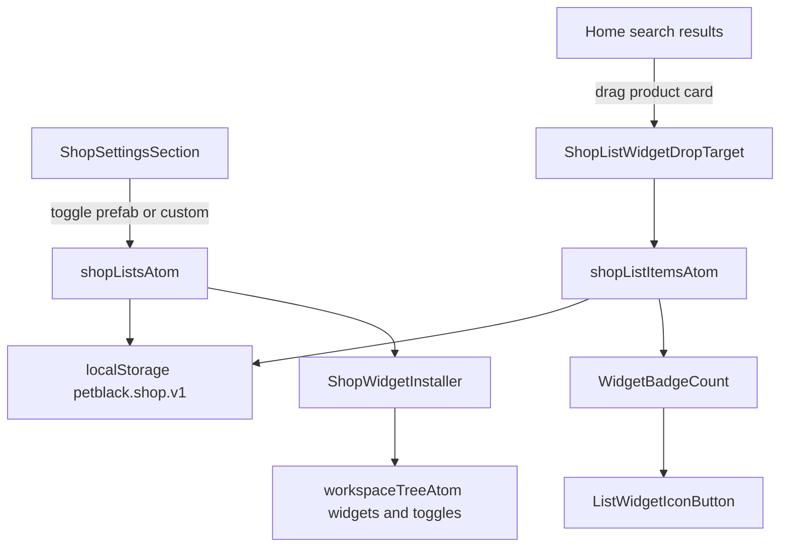

# Petblack Shop Section + List Widgets Plan

## Goals
- Add a **Shop** section to the Shelly-managed settings dialog in `apps/petblack-com`.
- Let users manage shopping lists (prefab + custom), where each active list maps to a **Shelly widget** (floating icon button that expands to a dialog).
- Persist list definitions and line items (`sku`, `quantity`) in local storage.
- Provide workflow-specific dialogs for `cart`, `pick`, and `auto` lists.
- Explicitly document concept semantics for `drug` and `diet` lists as vet-approval/verification required.

## Scope and behavior
- Prefab lists: `cart`, `want`, `need`, `have`, `pick`, `auto`, `drug`, `diet`.
- `cart` is prefab and **initially active**, but can be deactivated by user.
- Default activation:
  - ON: `cart`, `want`, `need`
  - OFF: `have`, `pick`, `auto`, `drug`, `diet`
- `pick` and `auto` are separate shopping modes with dedicated flows.
- Custom lists can be created with user-selected icon/emoji (including pet-themed icons).
- Prefab lists already include default icon + title metadata.
- Every active list renders a dedicated widget via Shelly registration + toggle wiring.
- Each list widget shows an item-count badge (small round count indicator).
- Main page supports dragging product cards from search results into list widgets.

## Architecture mapping (current extension points)
- App boot/effects:
  - [c:\workspace\apps\petblack-com\src\app\bootstrap.tsx](c:\workspace\apps\petblack-com\src\app\bootstrap.tsx)
  - [c:\workspace\apps\petblack-com\src\atoms\petblack-effect-atom.ts](c:\workspace\apps\petblack-com\src\atoms\petblack-effect-atom.ts)
- Existing widget example (Buddy):
  - [c:\workspace\apps\petblack-com\src\widgets\buddy\install.ts](c:\workspace\apps\petblack-com\src\widgets\buddy\install.ts)
  - [c:\workspace\apps\petblack-com\src\widgets\buddy\buddy-widget.tsx](c:\workspace\apps\petblack-com\src\widgets\buddy\buddy-widget.tsx)
  - [c:\workspace\apps\petblack-com\src\widgets\buddy\toggles\buddy-show-toggle.ts](c:\workspace\apps\petblack-com\src\widgets\buddy\toggles\buddy-show-toggle.ts)
- Settings section registration pattern:
  - [c:\workspace\packages\shelly\src\sections\section-entry.ts](c:\workspace\packages\shelly\src\sections\section-entry.ts)
  - [c:\workspace\packages\shelly\src\settings\settings-dialog-path.ts](c:\workspace\packages\shelly\src\settings\settings-dialog-path.ts)
  - Example package integrations: `packages/stashy`, `packages/robotify`, `packages/codify` install effects
- Dialog layout patterns:
  - Wizard/Carousel APIs in Shelly modal system (`DialogLayouts.Wizard`, `DialogLayouts.Carousel`) for multi-step and carousel flows.

## Proposed implementation

### 1) Domain model + persistence (Shop state)
- Add a new shop domain module in `apps/petblack-com/src/widgets/shop/domain/` with:
  - `ShopListType`: `prefab | custom`
  - `ShopListKind`: `cart | want | need | have | pick | auto | drug | diet | custom`
  - `ShopList` metadata: `id`, `kind`, `title`, `icon`, `active`, `isPrefab`, `createdAt`
  - `ShopLineItem`: `sku`, `quantity`, `updatedAt`
  - `ShopListItemsByListId` map keyed by list id
- Local storage adapter (`shop-storage.ts`) with versioned schema key, e.g. `petblack.shop.v1`.
- Startup migration that seeds missing prefabs with defaults:
  - ON: `cart`, `want`, `need`
  - OFF: `have`, `pick`, `auto`, `drug`, `diet`
- Ensure deactivate/activate only flips `active` (does not delete content).

### 2) Atom layer integrated with Shelly patterns
- Add atoms in `apps/petblack-com/src/widgets/shop/atoms/` for:
  - `shopListsAtom` and `shopListItemsAtom` (hydrated from storage)
  - selectors: active lists, item counts per list, total count per widget
  - actions: create custom list, toggle list active, set icon, add/remove/update SKU quantity
- Keep `workspaceTreeAtom` as structural registry source of truth for widget/toggle entries; use shop atoms for content state.

### 3) Shop settings section in Settings dialog
- Add `ShopSettingsSection` UI in `apps/petblack-com/src/settings/shop/`.
- Register a settings section under `SETTINGS_DIALOG_PATH` from petblack install effect.
- Section UX:
  - Prefab checklist (including `cart`, `want`, `need`, `have`, `pick`, `auto`, `drug`, `diet`) with icon + description.
  - Custom list creator (name + icon picker/emoji picker).
  - Inline notes for vet-approval requirement on `drug` and `diet`.
- Toggling list active/inactive should register/unregister widget entries (or keep entry and toggle visible state depending on existing Shelly convention used by buddy-like widgets).

### 4) Widget registration strategy (one widget per list)
- Build a generic `ShopListWidget` component shell (floating/dockable, buddy-style) and per-kind dialog content components.
- Add installer module in `apps/petblack-com/src/widgets/shop/install.ts` that:
  - Generates stable widget/toggle paths per list id
  - Registers toggle entries and widget entries with Shelly
  - Cleans up unregister handlers when list deactivates or is removed
- Keep prefab widgets reproducible from persisted list ids to avoid path drift between sessions.

### 5) Specialized dialog flows
- **Cart widget dialog (Wizard layout):**
  1. Cart lines (editable quantities)
  2. Delivery method (speed + address)
  3. Payment method
  4. Review + Pay
  5. Confirmation
- **Pick widget dialog (Carousel or Wizard):**
  - Step for state selection
  - Step for zipcode search
  - Step for map + nearby store selection
- **Auto widget dialog:**
  - Frequency selection
  - Next delivery date
  - Last delivery date
- **Other lists (`want/need/have/custom/drug/diet`):**
  - Standard list dialog with SKU/qty management and optional notes.

## Data and interaction flow

## 6) Drag-and-drop from search results to list widgets
- Enhance product card rendering in:
  - [c:\workspace\apps\petblack-com\src\components\product-grid.tsx](c:\workspace\apps\petblack-com\src\components\product-grid.tsx)
  - [c:\workspace\apps\petblack-com\src\components\home-section.tsx](c:\workspace\apps\petblack-com\src\components\home-section.tsx)
- Add drag payload: product id/sku/title minimal object.
- Add drop zones on list widgets (collapsed and/or expanded states).
- On drop, add/increment line item in target list.
- Add keyboard/mouse fallback action (“Add to list”) if drag is unavailable.

## 7) Documentation deliverables (required)
- Add shop concept docs in `apps/petblack-com/docs/`:
  - `shop-lists-concept.md` with semantics for each prefab list.
  - `drug-diet-verification.md` detailing vet approval and verification expectations, lifecycle states, and constraints.
  - `shop-workflows.md` covering Cart/Pick/Auto dialog flows.
- Include explicit note: custom pet-specific lists may represent want/need conceptually, but runtime model treats them as generic custom lists.

## 8) Validation and rollout
- Validate registration lifecycle: enable/disable lists from settings reflects widget visibility immediately.
- Validate persistence across reload for list definitions, icons, and line items.
- Validate drag/drop, quantity updates, and badge counts.
- Validate wizard/step flows for cart/pick/auto complete successfully.
- Add targeted unit tests where atom logic is isolated; add lightweight component tests for key list actions if current app test setup supports it.

## Risks to address during implementation
- Stable widget path generation for dynamic custom lists (avoid orphaned toggles/widgets).
- Potential overlap with existing Shelly dialog action paths and navigation atoms.
- DnD conflicts with widget drag/dock behavior; may need dedicated drop overlays or explicit drop mode when dragging products.
- Date/time handling for autoship fields (timezone edge cases).